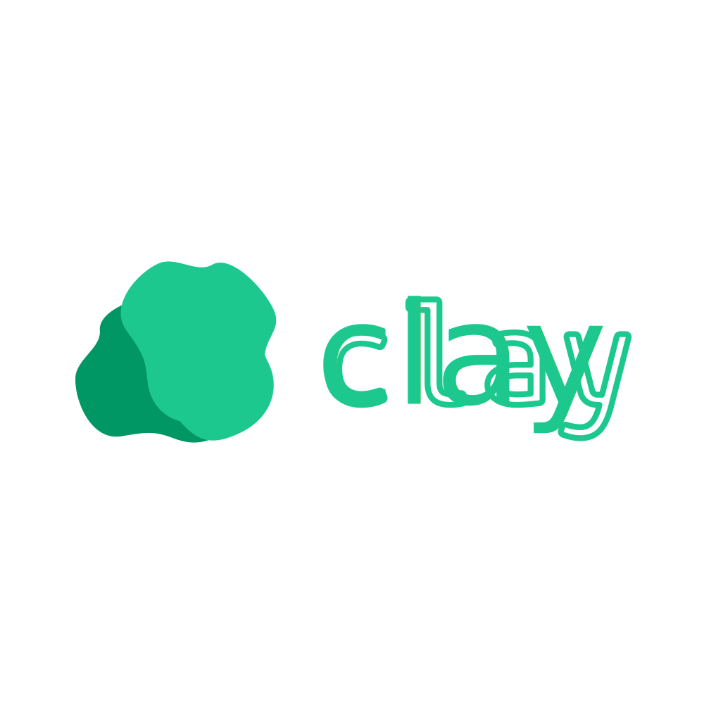

Clay is a documentation framework designed to help developers to speed up their development efforts
by providing a structured and auto-generated system for displaying documentation in a neat way.

Clay is built on **[nuxt.js](https://nuxt.com/)** with **[vue.js](https://vuejs.org/)** and uses **Markdown** files for writing documentation content.

## Capabilities
- Auto-generates documentation structure based on the contents of the `docs/` directory.
- User-friendly and modern UI via **[daisyUI](https://daisyui.com/)** **[tailwindcss](https://tailwindcss.com/)**.
- Rich Markdown parsing and rendering via **[marked.js](https://marked.js.org/)**.
- Syntax highlighting for code blocks using **[shiki](https://shiki.matsu.io/)**.
- Customizable configuration via `clay.yaml`.
- Easy integration into existing projects with minimal setup.
- [WORK IN PROGRESS] Search functionality for documentation.
- [WORK IN PROGRESS] Theme customization and support for multiple themes.
- [WORK IN PROGRESS] Multi-language support for documentation content.
- [WORK IN PROGRESS] Versioning support for documentation.
- [WORK IN PROGRESS] OpenAPI/Swagger documentation support and rendering both in Markdown docs and in a collected place.

> [!IMPORTANT]
> Clay is **not** a **static site generator**.
> It is a documentation framework that can be integrated into existing projects with minimal effort.

## How it works
Clay is built in a way that allows developers to integrate it into their repositories with minimal effort.
The clay frontend is pre-built and can load all the configuration it needs from a couple of configuration files.

## Structure
The structure of a Clay documentation project is designed to be simple and intuitive.
The focus was on forcing as little external configuration as possible, so clay can be included in any projects repository
with minimal effort and without needing to change existing structures and set up complex static site generators.
```text
~
├── docs                             # Documentation directory
│   ├── my-doc.md                    # Documentation file (Markdown)
│   ├── my-other-doc.md              # Documentation file (Markdown)
│   └── my-sub-directory             # Sub-directory for organizing docs
│       ├── nested-doc.md            # Nested documentation file (Markdown)
│       └── another-nested-doc.md    # Nested documentation file (Markdown)
├── clay.yaml                        # Main configuration file
├── clay-structure.yaml              # Documentation structure file (generated by clay-oven)
└── logo.svg                         # Optional logo file
```

## Configuration
Clay uses two main configuration files:
- `clay.yaml`: Main configuration file for setting up Clay.
- `clay-structure.yaml`: Documentation structure file generated by Clay Oven.

### config.yaml
The `clay.yaml` file is used to configure the main settings of Clay.
Here is an example configuration:
```yaml
title: "Demo"
favicon: "logo.svg"
fontawesomeKit: "0a7e2ccef9"
navbar:
  logo: "logo.svg"
  source:
    name: "Github"
    icon: "fa-brands fa-github"
    link: "https://github.com"
  links:
    - name: "Homepage"
      icon: "fa-solid fa-house"
      link: "https://example.com"
    - name: "Jobs"
      icon: "fa-solid fa-briefcase"
      link: "https://example.com/jobs"
index:
  title: "Welcome to the Demo"
  description: "This is a demo application."
  icon: "fa-solid fa-rocket"
langs:
  - "cs"
  - "python"
  - "js"
```

### clay-structure.yaml
The `clay-structure.yaml` file is generated by Clay Oven and defines the structure of the documentation.
It is automatically created and updated by Clay Oven based on the contents of the `docs/` directory.
The schema behind this looks complex but is actually quite simple. Let's take a look at one line:

```yaml
product1.md#Product 1#fa-solid fa-box
```

The line can be split into three parts using the `#` character as a separator:
1. `product1.md`: The path to the Markdown file containing the documentation content.
2. `Product 1`: The title of the documentation page as it will appear in the navigation.
3. `fa-solid fa-box`: The FontAwesome icon class that will be displayed next to the title in the navigation.

Here is an example structure:
```yaml
docs:
    - "index.md#Overview#fa-solid fa-home"
    - "help.md#Help#fa-solid fa-question-circle"
    - products#Products#fa-solid fa-boxes:
        - "product1.md#Product 1#fa-solid fa-box"
        - "product2.md#Product 2#fa-solid fa-box"
    - about#About#fa-solid fa-info-circle:
        - "team.md#Team#fa-solid fa-users"
        - "company.md#Company#fa-solid fa-building"
        - tutorials#Tutorials#fa-solid fa-graduation-cap:
            - "tutorial1.md#Tutorial 1#fa-solid fa-chalkboard-teacher"
            - "tutorial2.md#Tutorial 2#fa-solid fa-chalkboard-teacher"
            - "tutorial3.md#Tutorial 3#fa-solid fa-chalkboard-teacher"
            - "tutorial4.md#Tutorial 4#fa-solid fa-chalkboard-teacher"
            - other#Other Guides#fa-solid fa-book-open:
                - "advanced.md#Advanced Topics#fa-solid fa-brain"
                - "tips.md#Tips and Tricks#fa-solid fa-lightbulb"
```