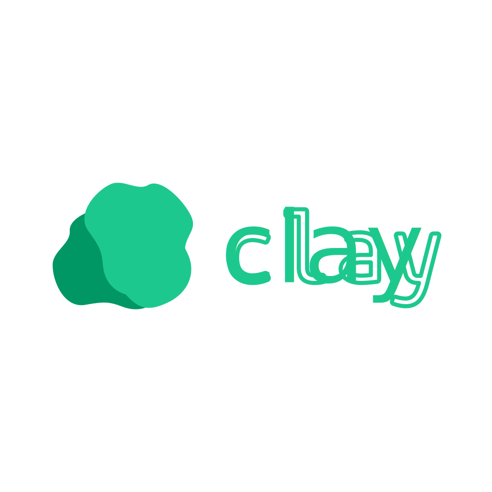

<p align="center">
  
</p>

<h1 align="center">Clay</h1>

<p align="center">
  <strong>A documentation framework for developers, built on <a href="https://nuxt.com/">Nuxt.js</a> and <a href="https://vuejs.org/">Vue.js</a>.</strong>
</p>

<p align="center">
  <a href="https://github.com/clay-doc/clay/releases/latest"></a>
  <a href="https://github.com/clay-doc/clay/blob/main/LICENSE"></a>
</p>

---

Clay is a documentation framework designed to help developers speed up their development efforts by providing a structured and auto-generated system for displaying documentation in a neat way. It uses **Markdown** files for writing documentation content.

> [!IMPORTANT]
> Clay is **not** a static site generator.
> It is a documentation framework that can be integrated into existing projects with minimal effort.

## Capabilities

- Auto-generates documentation structure based on the contents of the `docs/` directory.
- User-friendly and modern UI via **[daisyUI](https://daisyui.com/)** and **[Tailwind CSS](https://tailwindcss.com/)**.
- Rich Markdown parsing and rendering via **[marked.js](https://marked.js.org/)**.
- Syntax highlighting for code blocks using **[Shiki](https://shiki.matsu.io/)**.
- Customizable configuration via `clay.yaml`.
- Easy integration into existing projects with minimal setup.

## How It Works

Clay is built in a way that allows developers to integrate it into their repositories with minimal effort. The Clay frontend is pre-built and can load all the configuration it needs from a couple of configuration files.

## Project Structure

```text
.
├── docs/                        # Documentation directory
│   ├── my-doc.md                # Markdown documentation file
│   ├── my-other-doc.md
│   └── my-sub-directory/
│       ├── nested-doc.md
│       └── another-nested-doc.md
├── clay.yaml                    # Main configuration file
├── clay-structure.yaml          # Structure file (generated by Clay Oven)
└── logo.svg                     # Optional logo
```

## Configuration

Clay uses two main configuration files:

| File                  | Description                                              |
|-----------------------|----------------------------------------------------------|
| `clay.yaml`           | Main configuration file for setting up Clay.             |
| `clay-structure.yaml` | Documentation structure file generated by Clay Oven.     |

### clay.yaml

The `clay.yaml` file is used to configure the main settings of Clay:

```yaml
title: "Demo"
favicon: "logo.svg"
baseURL: "/"
fontawesomeKit: "0a7e2ccef9"
navbar:
  logo: "logo.svg"
  source:
    name: "Github"
    icon: "fa-brands fa-github"
    link: "https://github.com"
  links:
    - name: "Homepage"
      icon: "fa-solid fa-house"
      link: "https://example.com"
    - name: "Jobs"
      icon: "fa-solid fa-briefcase"
      link: "https://example.com/jobs"
index:
  title: "Welcome to the Demo"
  description: "This is a demo application."
  icon: "fa-solid fa-rocket"
langs:
  - "cs"
  - "python"
  - "js"
```

### clay-structure.yaml

The `clay-structure.yaml` file is generated by [Clay Oven](https://github.com/clay-doc/clay-oven) and defines the structure of the documentation. Each entry follows the format:

```
<path>#<title>#<icon>
```

| Part    | Example                | Description                                    |
|---------|------------------------|------------------------------------------------|
| Path    | `product1.md`          | Path to the Markdown file.                     |
| Title   | `Product 1`            | Display title in the navigation.               |
| Icon    | `fa-solid fa-box`      | FontAwesome icon class for the navigation.     |

Here is an example structure:

```yaml
docs:
    - "index.md#Overview#fa-solid fa-home"
    - "help.md#Help#fa-solid fa-question-circle"
    - products#Products#fa-solid fa-boxes:
        - "product1.md#Product 1#fa-solid fa-box"
        - "product2.md#Product 2#fa-solid fa-box"
    - about#About#fa-solid fa-info-circle:
        - "team.md#Team#fa-solid fa-users"
        - "company.md#Company#fa-solid fa-building"
```

## Building a Clay Bundle

> **Tip:** It is recommended to use **[Clay Oven](https://github.com/clay-doc/clay-oven)** for building documentation. Clay Oven automatically gathers and modifies the latest built bundle during build time from your config.

To build a Clay bundle from this repository manually:

1. Install dependencies:
```bash
npm install
```

2. Build the project:
```bash
npm run generate
```

You can use the `BASE_URL` environment variable to specify the base URL:

```bash
BASE_URL=/docs/ npm run generate
```

## Related

- [Clay Oven](https://github.com/clay-doc/clay-oven) — The build tool for Clay documentation sites.
- [Clay Example Repo](https://github.com/clay-doc/clay-example-repo) — A fully working example project.

## License

This project is licensed under the Apache License 2.0 — see [LICENSE](LICENSE) for details.

